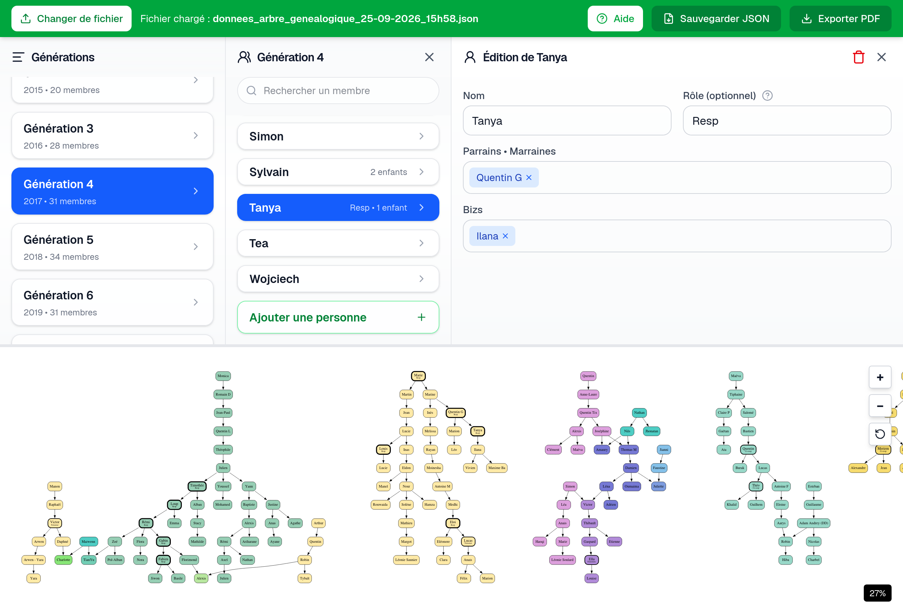

# Outil de création d'arbre généalogique de parrainage



Dans de nombreuses écoles, les étudiant·e·s de première année sont parrainé·e·s par des étudiant·e·s de deuxième année. L'année suivante, ces étudiant·e·s parrainent à leur tour, ce qui crée des arbres généalogiques. Contrairement aux arbres familiaux traditionnels, ces structures peuvent être très complexes : multiples parrains et marraines, multiples parrainé·e·s, regroupement avec des « frères » ou des « cousins », etc.

Cette application permet aux de créer et d'éditer ces graphes de parrainage complexes à travers une interface graphique simple.

Un algorithme essaie d'agencer automatiquement les nœuds afin de minimiser le nombre de liens qui se croisent et de créer des arbres plus lisibles. Chaque lignée possède une couleur, qui se mélange en cas de croisement.

## Données

Les données sont importées puis exportées dans un format JSON que les étudiant·e·s doivent stocker eux·elles-mêmes. Cela permet de ne pas lock-in les données dans mon application : s'ils et elles le veulent, les étudiant·e·s pourront donc écrire leur propre outil dans le futur en réutilisant les données exportées.

Le format est le suivant :

```json
{
  "first_year": 2014,

  "children_tree": [ 
    {
      "Claire": {"children": ["Emmanuelle", "Alicia"], "title": "Resp"},
      "Yoann": {"children": ["Ludovic"]}
    },
    {
      "Emmanuelle": {"children": ["Nathan"]},
      "Ludovic": {"children": ["Patrick", "Nathan"], "title": "Resp"},
      "Alicia": {"children": [], "title": "Trésorière"}
    },
    {
      "Nathan": {"children": []},
      "Patrick": {"children": []}
    }
  ]
}
```

Vous trouverez un exemple de données plus complet dans le fichier `example_data.json`.


## Export

L'application crée un graphe en `dot` qui est rendu en SVG grâce à la bibliothèque `vis.js` (Graphviz compilée en WebAssembly). Pour l'export, `jsPDF` convertit le SVG en PDF.

Le format PDF est facilement partageable sur des groupes de discussions d'étudiant·e·s (WhatsApp, Messenger, etc.), et est ouvrable et zoomable à l'infini, même sur smartphone.

## Comment modifier l'application ?

Utiliser les commandes suivantes :

```bash
git clone https://github.com/gabinollier/arbre-de-parrainage.git
cd arbre-de-parrainage
npm install
npm run dev
```

Sentez-vous libre d'envoyer des pull requests pour apporter vos modifications.